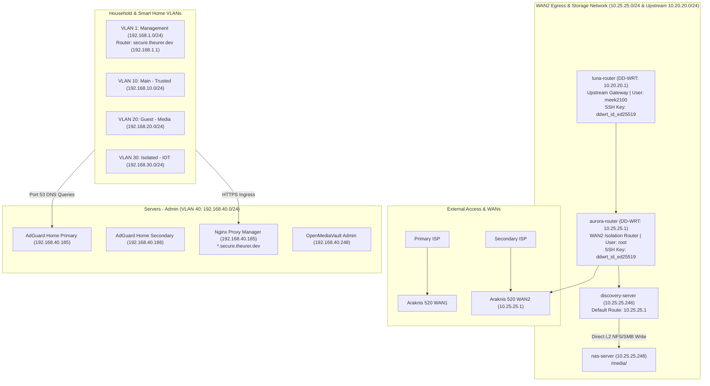

# 🌐 Homelab Network Infrastructure & Topology Blueprint

This document details the physical hardware, virtual bridges, dual-WAN egress paths, DNS coordination, and ingress proxies across the homelab infrastructure.

---

## 🏛️ Physical Network Hardware

### 1. Core Router: Araknis 520 Dual-WAN Router
* **Management IP**: `192.168.1.1` (`secure.theurer.dev`)
* **Role**: Primary Layer 3 Gateway, Inter-VLAN Firewall, Hardware NAT, DHCP Server.
* **Dual-WAN Configuration**:
  * **WAN1 (Primary)**: Connects primary ISP. Serves all general household traffic across `Management` (VLAN 1), `Main - Trusted` (VLAN 10), `Guest - Media` (VLAN 20), `Isolated - IOT` (VLAN 30), and `Servers - Admin` (VLAN 40).
  * **WAN2 (`10.25.25.1`)**: Dedicated secondary internet egress route. Serves `discovery-server` (`10.25.25.246`) to isolate heavy VPN and torrent traffic from household internet usage.
* **DHCP Scope Configuration**:
  * All active DHCP scopes configure **DHCP Option 6 (DNS)** to point to:
    * Primary DNS: **`192.168.40.185`** (`nexus-server` on `pve`)
    * Secondary DNS: **`192.168.40.186`** (`nexus-server2` on `pve3`)

### 2. Distribution Switch: Araknis 920 Managed Switch
* **Management IP**: `192.168.1.215` (VLAN 1)
* **Role**: Multi-Gigabit (2.5GbE / 10G SFP+) Layer 2+ Core Switch.
* **802.1Q Trunk Port Allocations**:
  * Carries tagged VLANs: **1, 10, 20, 30, 40, 100, 150, 200**.
  * Native Untagged PVID: **VLAN 1 (`Management`)**.
  * Uplinks to Proxmox Hypervisors:
    * `pve`: Dell Precision 5520 (`lan0` bound to `vmbr0`)
    * `pve2`: Awow AK34Pro (`enp1s0` bound to `vmbr0`)
    * `pve3`: HP EliteDesk (`eno1` bound to `vmbr0`)
  * Uplinks to Araknis 830 APs.
* **Multicast Optimization & Routing (FASTPATH Multicast Package)**:
  * **IGMP Snooping v2/v3 & Querier**: Enabled on VLANs 1, 10, 20, 40 to prevent mDNS and SSDP multicast floods from exhausting wireless airtime on the APs.
  * **Switch-Native Multicast Relay & Forwarding Database (MFDB)**: The 920 switch natively tracks multicast group memberships (e.g. `225.1.0.0` Control4/SnapOne discovery, `239.255.255.250` SSDP, `224.0.0.251` mDNS) directly in hardware ASIC across VLANs. **No Docker `multicast-relay` container is needed or desired**, eliminating software bridging loops.
  * **Static ARP & Static Multicast**: Supports hardware-pinned static ARP entries to prevent ARP timeouts and unicast flooding for critical IoT controllers and bridges (Control4, Hue).
* **Management & CLI Protocols (AN-920-SW-F-24-POE)**:
  * **Web GUI**: HTTP/HTTPS on `192.168.1.215`.
  * **CLI Shell**: Supports native **SSH Version 2 (port 22)** and Telnet with RSA/DSA host keys. Allows scriptable CLI audits, port status inspection, and programmatic PoE port power-cycling.
* **Port Mirroring (SPAN)**:
  * Configured to mirror selected inspection traffic into **VLAN 100 (`Wireshark - Debug`)** or to `pve` physical interface `lan1` (`vmbr1` with `promisc on`).

### 3. Wireless Access Points & Office Point-to-Point Bridge: Araknis 830 APs (Wi-Fi 7 / 802.11be)
* **Fleet Hardware Profile**: Three Araknis Access Points:
  * **AP 1 (Core Wired + Bridge Master)**: `192.168.1.231` (MAC `14:3F:C3:E8:B9:93`, Local BSSID `36:3F:C3:E8:B9:96`).
    * Radios: 2.4GHz Ch 6 (20MHz, 23dBm), 5GHz Ch 36 (80MHz, 27dBm), 6GHz Ch 21 (160MHz, 25dBm).
    * Dual Role: Broadcasts client SSIDs and acts as the **Wired Bridge Master** for the office backhaul.
  * **AP 2 (Core Wired)**: `192.168.1.236` (MAC `14:3F:C3:E8:B9:A2`).
    * Radios: 2.4GHz Ch 1 (20MHz, 23dBm), 5GHz Ch 149 (80MHz, 27dBm), 6GHz Ch 69 (160MHz, 25dBm).
    * Role: Broadcasts client SSIDs across high-band 5GHz and 6GHz.
  * **AP 3 (Office Wireless Bridge Client)**:
    * Local BSSID `36:3F:C3:E8:B9:23`.
    * Role: Dedicated **Wireless Bridge** client connecting the physical office segment to AP 1 without broadcasting client SSIDs, providing transparent Layer 2 ethernet connectivity until physical cabling is pulled.
* **Point-to-Point Wireless Backhaul Specification**:
  * **Backhaul SSID**: `Insomniac_Bridge`
  * **Radio Band**: 5 GHz (Ch 36, 80 MHz channel width)
  * **Security**: `WPA3-SAE (Fixed)` with pre-shared passkey.
  * **Transparent L2 Bridging**: Passes untagged management and 802.1Q tagged VLANs transparently across the air.
* **Authoritative Client SSID Configuration**:
  * **`Insomniac_MGMT`** (Native VLAN 1): 5 GHz & 6 GHz, WPA3-SAE, Fast Roaming enabled, Client Isolation OFF. Dedicated for wireless administrative/hypervisor access.
  * **`Insomniac`** (VLAN 10 — `Main - Trusted`): 5 GHz & 6 GHz only, WPA3-SAE, Fast Roaming enabled, Client Isolation OFF. Primary high-speed network for phones, laptops, and workstations.
  * **`Insomniac_Guest`** (VLAN 20 — `Guest - Media`): 2.4 GHz & 5 GHz, WPA2/WPA3-SAE Mixed, Band Steering ON, Fast Roaming ON, **Client Isolation OFF**. Destination for Sonos speakers, Smart TVs, and streaming guests.
  * **`Insomniac_IOT`** (VLAN 30 — `Isolated - IOT`): 2.4 GHz only, WPA2-PSK, Fast Roaming OFF (prevents legacy 802.11b/g/n chip dropouts), Wi-Fi 6/7 OFF, Client Isolation OFF. Strictly for smart plugs, bulbs, and microcontrollers.

### 4. Auxiliary Office Infrastructure: OpenWrt Router & Office Switch
* **Physical Office Ingress Chain**:
  ```text
  Araknis 520 Router (192.168.1.1)
    └── Araknis 920 Core Switch (192.168.1.215)
          └── Araknis 830 AP 1 (Wired Master: 192.168.1.231)
                └── [5GHz PTP Backhaul: Insomniac_Bridge]
                      └── Araknis 830 AP 3 (Office Station Bridge)
                            └── OpenWrt Router (Belkin AX3200: 192.168.1.226)
                                  └── Netgear Office Switch (192.168.1.220)
                                        └── Workstation PC
  ```
* **OpenWrt Router Hardware & Profile (Belkin AX3200)**:
  * **Primary Management IP**: `192.168.1.226` (Dropbear SSH on port 22)
  * **Out-of-Band Backup Management IP**: `10.99.99.1` (Available via optional 2.4GHz Wi-Fi or dedicated LAN port 1 if bridge/main routing drops)
  * **Authentication**: Dedicated SSH Key `pi_id_ed25519` (`/mnt/c/Users/dtheurer/.ssh/pi_id_ed25519` or `~/.ssh/pi_id_ed25519`)
  * **3-Priority Resilient Failover System (100% Verified in Production)**:
    1. **Priority 1 (P1 - Wire-Speed Split-Trunking)**: Direct physical wire to Bridged 830 AP (1500 MTU). Native untagged VLAN 1 flows at wire speed across the wire. Tagged VLANs (10, 20, 30, 40, 100, 150, 200) are encapsulated over `vxlan150` to VM 107 (`192.168.1.150`). Untagged VLAN 1 is isolated from VXLAN to eliminate L2 loops.
    2. **Priority 2 (P2 - Wireless VXLAN Tunnel)**: Layer 2 VXLAN tunnel (`vxlan150`, VNI 150, UDP 4789, MTU 1450, MSS clamped to 1406) routed over Wi-Fi 6 station `wl1-sta0` on `Insomniac_MGMT` (`192.168.1.225`) to VM 107 (`192.168.1.150`). OpenWrt dynamically adds untagged VLAN 1 to `vxlan150` for full office connectivity during physical wire outages (empirically tested at 573 Mbps, 0 packet loss).
    3. **Priority 3 (P3 - Relayd Wireless Standby)**: OpenWrt activates `relayd` pseudo-bridge on `wl1-sta0` if both physical wire and VM 107 are offline. Keeps untagged VLAN 1 (PC, switch UI, internet) alive while tagged VLANs gracefully sleep.
  * **Split Untagged Native / Tagged VXLAN Trunking Architecture (Verified & Active)**:
    * **Root Cause Addressed**: Araknis 830 AP wireless bridge strips 802.1Q tags across the air link, which historically forced all office switch devices onto untagged `192.168.1.0/24` or caused loops when bridging VLAN 1 in parallel.
    * **Active Production Architecture**:
      * **Untagged Traffic (VLAN 1 / Management)**: Passes natively across the physical AP bridge (1500 MTU) with zero overhead. Uses VXLAN only as standby failover if the AP bridge drops.
      * **Tagged Traffic (VLANs 10, 20, 30, 40, 100, 150, 200)**: Encapsulated over VXLAN into UDP packets (port 4789). Outer packets are standard untagged UDP and traverse the 830 AP bridge transparently without stripping.
      * **Loop Prevention**: Mutual exclusion for VLAN 1 across physical and virtual paths guarantees no Layer 2 loop can form. All 8 ports on Netgear GS108Ev2 switch maintain 0 CRC errors.
  * **Lab Network Integration**: Associated with **VLAN 150 (`CA-1 Test`)** for Control4 CA-1 automation controller testing.
* **Netgear Office Switch**:
  * **Management IP**: `192.168.1.220` (VLAN 1)
  * **Role**: Local desktop distribution switch connecting office PCs, printers, and test benches to the OpenWrt router.
  * **⚠️ No Official API or CLI**: The GS108Ev2 is a Netgear "Easy Smart" switch with **no HTTP REST API, no SSH, and no official programmatic interface**. It is exclusively managed via the **Netgear ProSAFE Plus Configuration Utility** (Windows/macOS desktop app).
  * **Protocol**: The ProSAFE utility communicates over a **proprietary Layer 2 protocol — NSDP (Netgear Switch Discovery Protocol)** — using UDP broadcast/unicast on **ports 63321 and 63322**. Standard HTTP/TCP requests cannot reach the switch management interface.
  * **Community Tooling**: The MCP tools (`backup_netgear_switch`, `get_netgear_switch_status`) use the open-source community libraries [`netgear-tool`](https://github.com/s-t-e-f-a-n-o/netgear-tool) and [`py-netgear-plus`](https://github.com/foxey/py-netgear-plus) which reverse-engineer the NSDP protocol. These libraries **must run on the same Layer 2 broadcast domain as the switch** (VLAN 1 / `192.168.1.0/24`) since NSDP does not route across Layer 3 boundaries. Additional candidate tools under investigation include [`nccgroup/nsdp-discover`](https://github.com/nccgroup/nsdp-discover) (protocol discovery & security assessment), [`AlbanBedel/libnsdp`](https://github.com/AlbanBedel/libnsdp) (C library & CLI), and [`yaamai/go-nsdp`](https://github.com/yaamai/go-nsdp) (Go implementation).


---

## 🛜 Subnets, Routing & Ingress Model



### 5. Upstream DD-WRT Routing Fleet (WAN2 & Dedicated Discovery Isolation)

* **Aurora Router (`aurora-router` — `10.25.25.1`)**:
  * **Role**: Primary gateway and isolation barrier for the high-bandwidth torrent / download network (`10.25.25.0/24`) on `vmbr1`.
  * **Management IP**: `10.25.25.1` (Dropbear/SSH on port 22).
  * **User**: `root` | **Identity**: `ddwrt_id_ed25519` (`C:/Users/dtheurer/.ssh/ddwrt_id_ed25519` or `~/.ssh/ddwrt_id_ed25519`).
  * **Clients**: `discovery-server` (`10.25.25.246`), `nas-server` (`10.25.25.248`), Araknis 520 `WAN2` port.
* **Luna Router (`luna-router` — `10.20.20.1`)**:
  * **Role**: Upstream gateway from `aurora-router`, operating the upstream `10.20.20.0/24` transit subnet.
  * **Management IP**: `10.20.20.1`.
  * **User**: `meek2100` | **Identity**: `ddwrt_id_ed25519` (`C:/Users/dtheurer/.ssh/ddwrt_id_ed25519` or `~/.ssh/ddwrt_id_ed25519`).


---

## 🔍 Domain & DNS Ingress Matrix

| FQDN / Pattern | Target IP | Destination Service | Ingress Method |
| :--- | :---: | :--- | :--- |
| **`secure.theurer.dev`** | `192.168.1.1` | Araknis 520 Router Management Web UI | Direct DNS A Record |
| **`*.secure.theurer.dev`** | `192.168.40.185` | Nginx Proxy Manager (`nexus-server`) | Split-Horizon DNS Wildcard Rewrite |
| **`wireshark.secure.theurer.dev`** | `192.168.40.185` | Wireshark Web GUI (`luna-server`:3000) | NPM Reverse Proxy + SSL Wildcard |
| **`portainer.secure.theurer.dev`** | `192.168.40.185` | Portainer CE Web UI | NPM Reverse Proxy + SSL Wildcard |
| **`plex.secure.theurer.dev`** | `192.168.40.185` | Plex Media Server (`media-server`:32400) | NPM Reverse Proxy + SSL Wildcard |
| **`ha.secure.theurer.dev`** | `192.168.40.185` | Home Assistant (`luna-server`:8123) | NPM Reverse Proxy + WebSocket Upgrade |
| **`home.secure.theurer.dev`** | `192.168.40.185` | Homarr Homelab Dashboard (`media-server`:80) | NPM Reverse Proxy + SSL Wildcard |
| **`vpn.theurer.dev`** | WAN IP / Dynamic | WireGuard Admin Gateway (`nexus-server`:51820) | Direct UDP Port Forward |
| **`all.ddnskey.com`** | `24.22.108.194` / `158.173.241.54` | Araknis 520 WAN1 & WAN2 Interface Tracking | No-IP Dynamic DNS Daemon |
| **`luna.servebeer.com`** | WAN1 / Upstream IP | Luna Router DD-WRT OpenVPN Tunnel Endpoint | No-IP DDNS |
| **`aurora.servebeer.com`** | WAN2 / Upstream IP | Aurora Router DD-WRT OpenVPN Tunnel Endpoint | No-IP DDNS |

---

## 🛡️ Dual-VPN Administrative Ingress Architecture

The homelab utilizes a resilient, dual-VPN remote access model ensuring both high-performance mobile access and an uninhibited, cloud-independent administrative lifeline:

```mermaid
graph TD
    subgraph RemoteClients ["Remote Clients (Phones, Laptops, Road Warriors)"]
        TC_CLIENT["Tailscale Client<br>(100.x.y.z)"]
        WG_CLIENT["WireGuard Client<br>(10.8.0.x)"]
    end

    subgraph Router ["Araknis 520 Router (192.168.1.1 & 192.168.40.1)"]
        PORT51820["WAN1 Port Forward<br>UDP 51820 ──► 192.168.40.185"]
        STATIC_ROUTES["Static Routing Table:<br>192.168.2.0/24 via 192.168.1.225 (LAN)<br>100.64.0.0/10 via 192.168.40.185 (LAN)<br>10.8.0.0/24 via 192.168.40.185 (LAN)<br>10.20.20.0/24 via 10.25.25.1 (WAN2)"]
    end

    subgraph Nexus ["nexus-server (VM 100 on pve - 192.168.40.185)"]
        WG["WireGuard (wg-easy Stack 44)<br>10.8.0.0/24 (MTU 1420)<br>MASQUERADE ──► eth0"]
        TS["Tailscale (Stack 69 v22)<br>100.70.65.45<br>Subnets: VLAN 1, 10, 20, 30, 40, Storage"]
        AG1["AdGuard Home Primary<br>Listening on *:53"]
        NPM["Nginx Proxy Manager<br>Listening on *:80, *:443"]
    end

    subgraph Targets ["Homelab Targets"]
        PVE1["pve Proxmox Mgmt (192.168.1.250:8006, :22)"]
        PVE3["pve3 Proxmox Mgmt (192.168.1.245:8006, :22)"]
        SW["Araknis 920 Switch (192.168.1.215:80)"]
        NAS["OpenMediaVault (192.168.40.248 & 10.25.25.248)"]
        DEVS["Workstations (VLAN 10) & 3D Printers (VLAN 30)"]
    end

    WG_CLIENT ── UDP 51820 ──► PORT51820 ──► WG
    TC_CLIENT ── Direct Mesh / DERP ──► TS

    WG ── Outbound to All VLANs ──► Targets
    TS ── Outbound to All VLANs ──► Targets
    Targets ── Return Path to 100.x / 10.8.x ──► STATIC_ROUTES ──► Nexus
```

### 1. Tailscale Mesh Ingress (`nexus-server/69` - v22)
* **Tailscale Node IP**: `100.70.65.45` (`tailscale-nexus.tail4499d6.ts.net`).
* **Advertised Subnets**: `192.168.1.0/24`, `192.168.10.0/24`, `192.168.20.0/24`, `192.168.30.0/24`, `192.168.40.0/24`, `10.25.25.0/24`.
* **Zero-NAT Real Client Tracking**: `--snat-subnet-routes=false` preserves client `100.x.y.z` IPs, allowing AdGuard Home to log and apply filtering policies per individual mobile device.
* **Return Path**: Relies on Araknis static route `100.64.0.0/10 via 192.168.40.185`.
* **Split DNS**: Tailscale admin console delegates `secure.theurer.dev` to `100.70.65.45` (Primary direct mesh) and `192.168.40.186` (Secondary HA on `pve3`).

### 2. WireGuard "Break Glass" Administrative Backdoor (`nexus-server/44`)
* **Endpoint**: `vpn.theurer.dev:51820/udp` (Port forwarded directly through Araknis WAN1).
* **Role**: Completely independent of third-party cloud infrastructure (operates if Tailscale or Cloudflare are offline).
* **Configuration**:
  * Client IP Range: `10.8.0.0/24`
  * Optimal MTU: `1420` (prevents PMTU blackholes and packet fragmentation).
  * Allowed IPs: `192.168.1.0/24, 192.168.10.0/24, 192.168.20.0/24, 192.168.30.0/24, 192.168.40.0/24, 10.25.25.0/24`.
  * DNS: `192.168.40.185`, `192.168.40.186`.
* **Full Administrative Reach**: Direct access to Proxmox Web UIs (`:8006`), SSH (`:22`), switch web consoles, router management, and private storage networks.
* **Return Path**: Relies on Araknis static route `10.8.0.0/24 via 192.168.40.185` to ensure return packets from VLAN 1 (`192.168.1.0/24`) and other subnets route back to `nexus-server` even if container MASQUERADE is bypassed or un-NATted.

### 3. Emergency Out-of-Band Fallback: Araknis 520 Router-Native OpenVPN & No-IP
* **Endpoint**: `all.ddnskey.com` on WAN1 (`24.22.108.194`).
* **Role**: True out-of-band hardware lifeline. Because this OpenVPN server runs directly inside the Araknis 520 router hardware and uses router-native No-IP DDNS, it functions even if all 3 Proxmox nodes, VMs, and Docker containers are completely powered down or unreachable.
* **WAN2 Role**: Strictly dedicated to **outbound-isolated egress** (torrent traffic and PIA VPN). Multi-hop NAT (Luna ➔ Aurora ➔ Araknis) and the Aurora killswitch make WAN2 an egress barrier rather than an inbound administrative route.
* **Client Profile Synchronization**: Because WireGuard client `.conf` profiles are generated statically, client devices must download a fresh profile or QR code from `https://vpn.theurer.dev:51821` whenever `WG_ALLOWED_IPS` or subnets are added.
