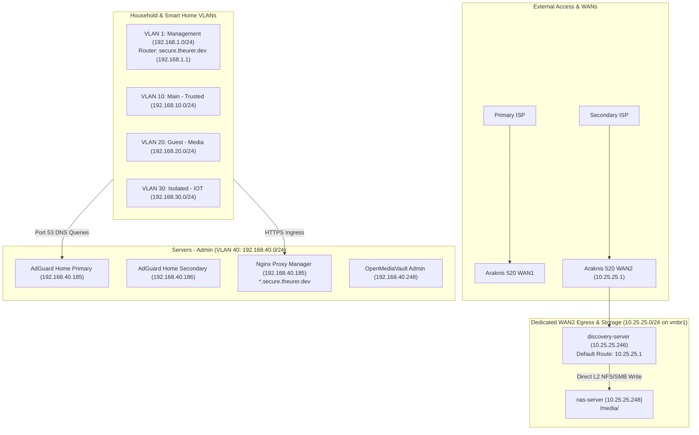

# 🌐 Homelab Network Infrastructure & Topology Blueprint

This document details the physical hardware, virtual bridges, dual-WAN egress paths, DNS coordination, and ingress proxies across the homelab infrastructure.

---

## 🏛️ Physical Network Hardware

### 1. Core Router: Araknis 520 Dual-WAN Router
* **Management IP**: `192.168.1.1` (`secure.theurer.dev`)
* **Role**: Primary Layer 3 Gateway, Inter-VLAN Firewall, Hardware NAT, DHCP Server.
* **Dual-WAN Configuration**:
  * **WAN1 (Primary)**: Connects primary ISP. Serves all general household traffic across `Management` (VLAN 1), `Main - Trusted` (VLAN 10), `Guest - Media` (VLAN 20), `Isolated - IOT` (VLAN 30), and `Servers - Admin` (VLAN 40).
  * **WAN2 (`10.25.25.1`)**: Dedicated secondary internet egress route. Serves `discovery-server` (`10.25.25.246`) to isolate heavy VPN and torrent traffic from household internet usage.
* **DHCP Scope Configuration**:
  * All active DHCP scopes configure **DHCP Option 6 (DNS)** to point to:
    * Primary DNS: **`192.168.40.185`** (`nexus-server` on `pve`)
    * Secondary DNS: **`192.168.40.186`** (`nexus-server2` on `pve3`)

### 2. Distribution Switch: Araknis 920 Managed Switch
* **Management IP**: `192.168.1.215` (VLAN 1)
* **Role**: Multi-Gigabit (2.5GbE / 10G SFP+) Layer 2+ Core Switch.
* **802.1Q Trunk Port Allocations**:
  * Carries tagged VLANs: **1, 10, 20, 30, 40, 100, 150, 200**.
  * Native Untagged PVID: **VLAN 1 (`Management`)**.
  * Uplinks to Proxmox Hypervisors:
    * `pve`: Dell Precision 5520 (`lan0` bound to `vmbr0`)
    * `pve2`: Awow AK34Pro (`enp1s0` bound to `vmbr0`)
    * `pve3`: HP EliteDesk (`eno1` bound to `vmbr0`)
  * Uplinks to Araknis 830 APs.
* **Multicast Optimization**:
  * **IGMP Snooping v2/v3 & Querier**: Enabled on VLAN 1 and VLAN 40 to prevent mDNS and SSDP multicast floods from exhausting wireless airtime on the APs.
* **Port Mirroring (SPAN)**:
  * Configured to mirror selected inspection traffic into **VLAN 100 (`Wireshark - Debug`)** or to `pve` physical interface `eth0` (`vmbr2` with `promisc on`).

### 3. Wireless Access Points: Araknis 830 APs
* **Role**: High-Density Wi-Fi Access Points.
* **SSID to VLAN Mapping**:
  * *Trusted / Private*: Mapped to VLAN 10 (`Main - Trusted`)
  * *Guest / Media*: Mapped to VLAN 20 (`Guest - Media`)
  * *Smart Home / IoT*: Mapped to VLAN 30 (`Isolated - IOT`) — 2.4 GHz only, 20 MHz channel width (channels 1, 6, 11).

### 4. Auxiliary Remote Node: OpenWrt Router
* **Management IP**: `192.168.1.225` (Dropbear SSH on port 22)
* **Role**: Remote network segment running a 3-Priority Failover System:
  * **Priority 1 (P1)**: Primary Wi-Fi Bridge via AP `192.168.1.237` (1500 MTU).
  * **Priority 2 (P2)**: L2 VXLAN tunnel (`vxlan150`, VNI 150, UDP 4789, MTU 1450, MSS clamped to 1406) connected to VM 107 (`vxlan-server`) on `pve`.
  * **Priority 3 (P3)**: Offline / VTEP recovery mode.
* **Lab Networks**:
  * Associated with **VLAN 150 (`CA-1 Test`)** for Control4 CA-1 controller integration.

---

## 🛜 Subnets, Routing & Ingress Model

---

## 🔍 Domain & DNS Ingress Matrix

| FQDN / Pattern | Target IP | Destination Service | Ingress Method |
| :--- | :---: | :--- | :--- |
| **`secure.theurer.dev`** | `192.168.1.1` | Araknis 520 Router Management Web UI | Direct DNS A Record |
| **`*.secure.theurer.dev`** | `192.168.40.185` | Nginx Proxy Manager (`nexus-server`) | Split-Horizon DNS Wildcard Rewrite |
| **`wireshark.secure.theurer.dev`** | `192.168.40.185` | Wireshark Web GUI (`luna-server`:3000) | NPM Reverse Proxy + SSL Wildcard |
| **`portainer.secure.theurer.dev`** | `192.168.40.185` | Portainer CE Web UI | NPM Reverse Proxy + SSL Wildcard |
| **`plex.secure.theurer.dev`** | `192.168.40.185` | Plex Media Server (`media-server`:32400) | NPM Reverse Proxy + SSL Wildcard |
| **`ha.secure.theurer.dev`** | `192.168.40.185` | Home Assistant (`luna-server`:8123) | NPM Reverse Proxy + WebSocket Upgrade |
